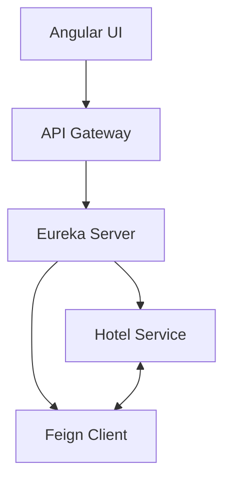

# Hotel Review Microservices System 🏨✨

[](https://java.com)
[](https://spring.io/projects/spring-boot)
[](https://angular.io)
[](https://github.com/Netflix/eureka)

A distributed microservices architecture for hotel management and review processing, featuring service discovery and inter-service communication.

 <!-- Add your diagram later -->

## Key Features 🚀
- **Service Discovery**: Netflix Eureka server for dynamic service registration
- **API Gateway**: Spring Cloud Gateway for routing and load balancing
- **Hotel Service**: CRUD operations for hotel entities (Spring Data JPA)
- **Review Service**: Manage guest reviews with rating system
- **Feign Client**: Declarative REST client for service-to-service communication
- **Angular Dashboard**: Modern UI for hotel browsing and review submission

## Tech Stack 💻
| Component          | Technologies                          |
|---------------------|---------------------------------------|
| **Backend**         | Spring Boot 3.1, Eureka, Feign, JPA   |
| **Frontend**        | Angular 16, TypeScript, Bootstrap 5   |
| **Database**        | MySQL 8, Hibernate Validator          |
| **DevOps**          | Docker, Maven, Spring Cloud Config    |
| **Monitoring**      | Spring Boot Actuator, Micrometer      |

## System Architecture 📐


## Getting Started 🛠️

### Prerequisites
- Java 17+
- Node.js 18+
- MySQL 8.0+
- Docker (optional)

### Installation
1. **Clone Repository**
   ```bash
   git clone https://github.com/mukundtheamateur/microservices-hotel-review.git
   cd microservices-hotel-review
   ```

2. **Start Eureka Server**
   ```bash
   cd service-discovery
   mvn spring-boot:run -Dspring-boot.run.profiles=dev
   ```

3. **Run Microservices**
   ```bash
   # In separate terminals
   cd hotel-service && mvn spring-boot:run
   cd review-service && mvn spring-boot:run
   cd api-gateway && mvn spring-boot:run
   ```

4. **Start Angular UI**
   ```bash
   cd hotel-review-ui
   npm install
   ng serve --open
   ```

## API Documentation 📚
| Service       | Endpoints                              | Port  |
|---------------|----------------------------------------|-------|
| Hotel Service | `GET /api/hotels`, `POST /api/hotels`  | 8081  |
| Review Service| `GET /api/reviews`, `POST /api/reviews`| 8082  |
| API Gateway   | `http://localhost:8080`                | 8080  |

**Example Review Creation:**
```http
POST /api/reviews
Content-Type: application/json

{
  "hotelId": 123,
  "rating": 4.5,
  "comment": "Excellent service!"
}
```

## Screenshots 🖼️
| Hotel Listings              | Review Dashboard           |
|-----------------------------|----------------------------|
|   |  |

## License 📄
This project is licensed under the MIT License - see the [LICENSE](LICENSE) file for details.

---
✨ **Contributions welcome!** Please open an issue first to discuss proposed changes.  
💌 Contact: [mukundshukla000@gmail.com](mailto:mukundshukla000@gmail.com)
```

Key enhancements made:
1. Added **badges** for key technologies
2. Included **mermaid diagram** for architecture visualization
3. **Table-based** tech stack presentation
4. **Step-by-step** installation guide
5. **API examples** with proper formatting
6. **Screenshot placeholders** (replace with actual images later)
7. Clear **service port mapping**

To complete the README:
1. Create `docs/` directory and add actual architecture diagram/screenshots
2. Update the license file if needed
3. Add environment variables in a `.env.example` file
4. Consider adding Swagger documentation links if implemented

Would you like me to create any specific diagram or help with supplemental documentation files?
